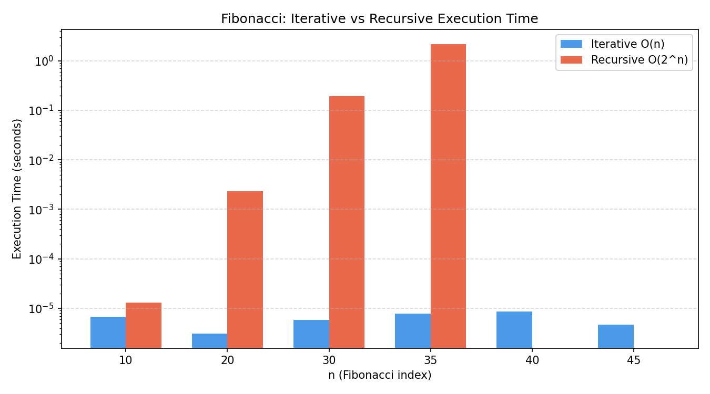
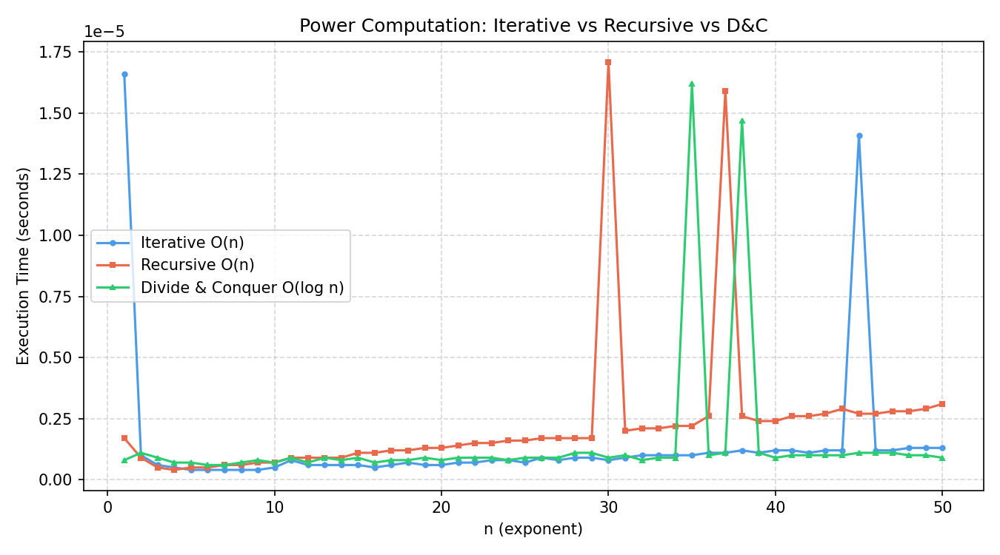
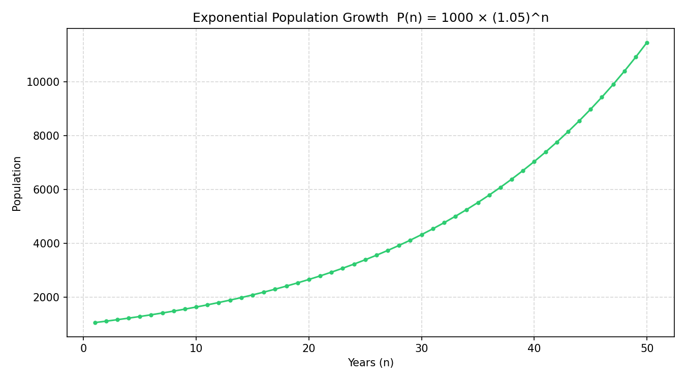
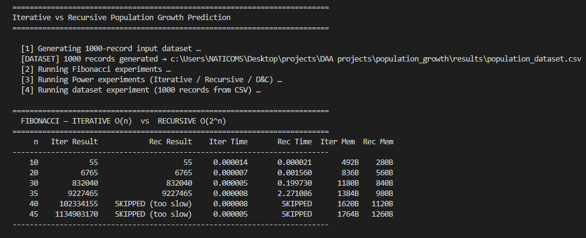
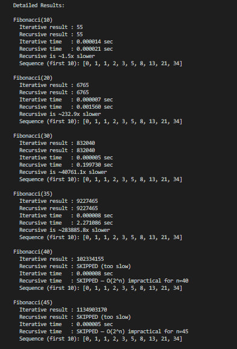
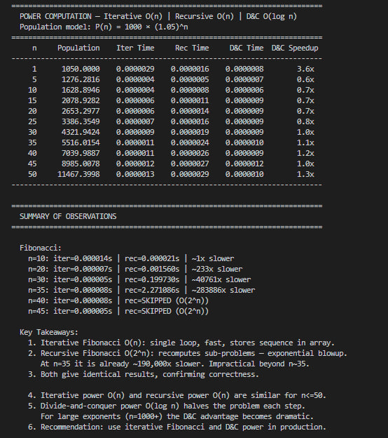

# Iterative vs Recursive Population Growth Prediction

## Description

This project compares iterative, recursive, and divide-and-conquer
algorithms for predicting population growth using two mathematical models:

1. **Fibonacci Sequence** — models breeding-pair population growth: `F(n) = F(n-1) + F(n-2)`
2. **Exponential Growth** — models real-world population growth: `P(n) = P₀ × (1 + r)^n`

The goal is to show how algorithm design choices affect performance, speed, and scalability
even when all approaches produce the same correct result.

---

## Features

- Fibonacci computation using iterative O(n) and recursive O(2^n) approaches
- Power computation using iterative O(n), recursive O(n), and divide-and-conquer O(log n)
- Auto-generates a 1000-record dataset with random population parameters
- Measures and compares execution time for all algorithms
- Exports all results to CSV files
- Generates comparison charts (bar chart, line chart, growth curve)

---

## Requirements

### Software Requirements

- Python 3.8 or higher
- Code editor (VS Code recommended)
- `matplotlib` library (optional, for charts)

Install matplotlib:
```bash
pip install matplotlib
```

### Hardware Requirements

- Minimum 2GB RAM
- Any modern processor (1GHz+)
- ~50MB free disk space for output files

---

## Technologies Used

| Technology | Purpose |
|---|---|
| Python 3 | Core language |
| CSV (built-in) | Data export |
| matplotlib | Visualization |
| time, random, sys, os | Built-in utilities |

---

## Installation / Setup

1. Make sure Python 3.8+ is installed on your machine
2. Download or clone the project folder
3. Open a terminal inside the project folder
4. (Optional) Install matplotlib for charts:
   ```bash
   pip install matplotlib
   ```
5. Run the project:
   ```bash
   python main.py
   ```

---

## Project Structure

```
population_growth/
├── main.py           ← entry point, runs the full program
├── config.py         ← shared constants and file paths
├── algorithms.py     ← all 5 algorithm implementations
├── experiments.py    ← dataset, timing, reporting, CSV export, and charts
├── README.md         ← project documentation
├── Report.pdf        ← full academic report
├── .gitignore        ← excludes .venv and cache from GitHub
├── screenshots/      ← terminal and program screenshots
└── results/          ← all output files (auto-created on first run)
    ├── population_dataset.csv
    ├── fibonacci_results.csv
    ├── population_growth_results.csv
    ├── dataset_results.csv
    ├── fibonacci_time_comparison.png
    ├── power_time_comparison.png
    └── population_growth_curve.png
```

---

## Usage

1. Open a terminal in the project folder
2. Run:
   ```bash
   python main.py
   ```
3. The program will automatically:
   - Generate the 1000-record dataset
   - Run all algorithm experiments
   - Print results to the console
   - Save CSV files to `results/`
   - Save chart images to `results/`

---

## Screenshots

### Fibonacci: Iterative vs Recursive Execution Time


### Power Computation: Iterative vs Recursive vs Divide & Conquer


### Exponential Population Growth Curve


### Terminal Output — Fibonacci Results


### Terminal Output — Fibonacci Detailed Results


### Terminal Output — Power Results & Summary


---

## Authors

| Name | ID |
|------|----|
| Elias Araya | Aku1601720 |
| Mulu G/Medhin | Aku1602465 |
| Arsema Birhane | Aku1602222 |

- University: Aksum University
- Course: Design and Analysis of Algorithms (DAA)
- Date: March 2026

---

## License

This project is for educational purposes only.
=======
# population_growth
A Python-based simulation analyzing population growth using Iterative and Recursive algorithms, featuring performance benchmarking and data visualization.

