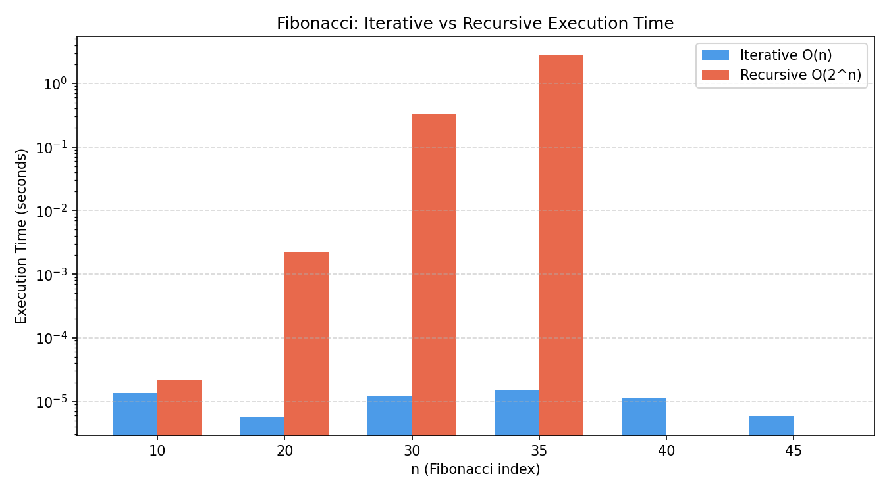
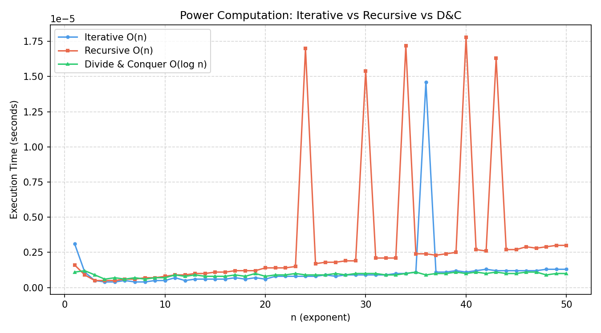
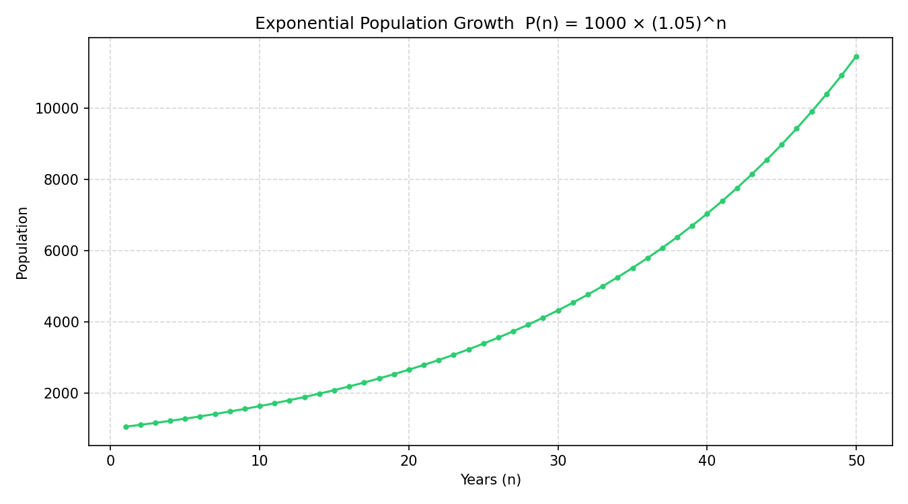
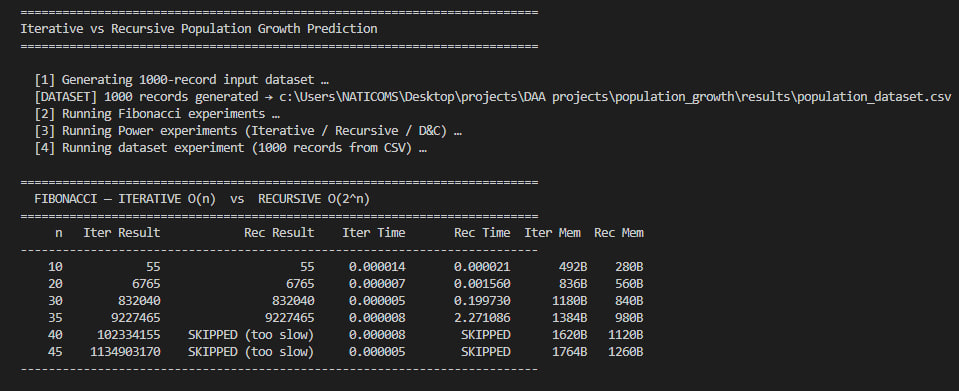
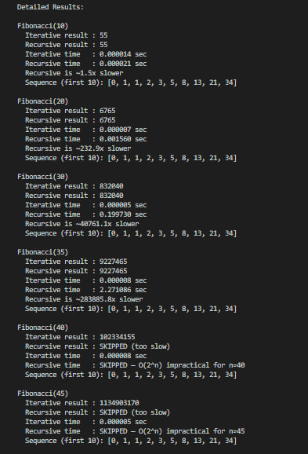
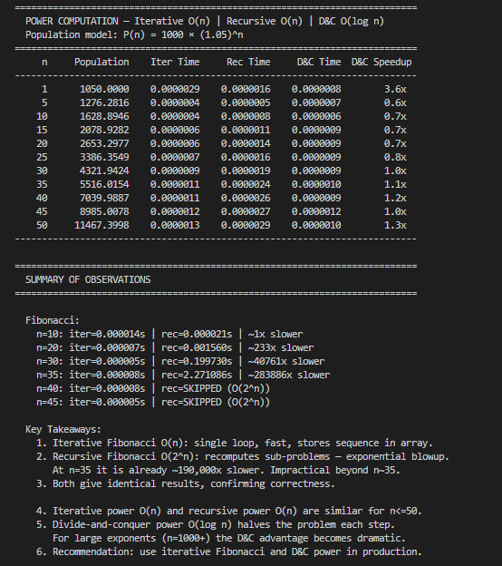

# 🧬 Iterative vs Recursive Population Growth Prediction

> A comprehensive algorithm analysis project comparing iterative, recursive, and divide-and-conquer approaches for population growth modeling.

[](https://www.python.org/)
[](LICENSE)
[](https://www.aku.edu.et/)

---

## 📋 Description

This project compares **three algorithmic paradigms** for predicting population growth using two mathematical models:

### 🐰 Fibonacci Sequence
Models breeding-pair population growth using the recurrence relation:
```
F(n) = F(n-1) + F(n-2)
```

### 📈 Exponential Growth
Models real-world population dynamics:
```
P(n) = P₀ × (1 + r)^n
```

**Goal:** Demonstrate how algorithm design choices dramatically affect performance, speed, and scalability — even when all approaches produce identical results.

---

## ✨ Features

- 🔄 **Fibonacci Computation** — Iterative O(n) vs Recursive O(2^n)
- ⚡ **Power Computation** — Iterative O(n), Recursive O(n), Divide-and-Conquer O(log n)
- 📊 **1000-Record Dataset** — Auto-generated with random population parameters
- ⏱️ **Performance Benchmarking** — Precise timing for all algorithms
- 📁 **CSV Export** — All results saved for further analysis
- 📉 **Visualization** — Bar charts, line graphs, and growth curves

---

## 🛠️ Technologies Used

| Technology | Purpose |
|---|---|
|  | Core language |
|  | Data export |
|  | Visualization |
|  | Version control |

---

## 📦 Installation

### Prerequisites
- Python 3.8 or higher
- pip package manager

### Setup

1️⃣ **Clone the repository**
```bash
git clone https://github.com/Elias-Btech/population_growth.git
cd population_growth
```

2️⃣ **Install dependencies** (optional, for charts)
```bash
pip install matplotlib
```

3️⃣ **Run the project**
```bash
python main.py
```

---

## 📂 Project Structure

```
population_growth/
│
├── 📄 main.py                    # Entry point
├── ⚙️ config.py                  # Configuration constants
├── 🧮 algorithms.py              # 5 algorithm implementations
├── 🔬 experiments.py             # Experiments, reporting, visualization
│
├── 📖 README.md                  # Project documentation
├── 📑 Report.pdf                 # Academic report
├── 🚫 .gitignore                 # Git exclusions
│
├── 📸 screenshots/               # Terminal output screenshots
│   ├── terminal_fibonacci.jpg
│   ├── terminal_fibonacci_detail.jpg
│   └── terminal_power_summary.jpg
│
└── 📊 results/                   # Auto-generated outputs
    ├── population_dataset.csv
    ├── fibonacci_results.csv
    ├── population_growth_results.csv
    ├── dataset_results.csv
    ├── fibonacci_time_comparison.png
    ├── power_time_comparison.png
    └── population_growth_curve.png
```

---

## 🚀 Usage

Run the main script to execute all experiments:

```bash
python main.py
```

The program will automatically:
1. ✅ Generate a 1000-record dataset
2. ✅ Run Fibonacci experiments (6 test cases)
3. ✅ Run Power experiments (50 test cases)
4. ✅ Run dataset experiments (1000 records)
5. ✅ Print detailed results to console
6. ✅ Export CSV files to `results/`
7. ✅ Generate visualization charts

---

## 📊 Results & Visualizations

### Fibonacci: Iterative vs Recursive Execution Time


### Power Computation: Iterative vs Recursive vs Divide & Conquer


### Exponential Population Growth Curve


---

## 🖥️ Terminal Output

<details>
<summary>📸 Click to view terminal screenshots</summary>

### Fibonacci Results


### Fibonacci Detailed Results


### Power Results & Summary


</details>

---

## 🎓 Key Findings

| Algorithm | Time Complexity | Space Complexity | Best Use Case |
|---|---|---|---|
| Fibonacci Iterative | O(n) | O(n) | ✅ Production use |
| Fibonacci Recursive | O(2^n) | O(n) | ❌ Impractical beyond n=35 |
| Power Iterative | O(n) | O(1) | Small exponents |
| Power Recursive | O(n) | O(n) | Educational purposes |
| Power Divide & Conquer | O(log n) | O(log n) | ✅ Large exponents |

**Recommendation:** Use iterative Fibonacci and divide-and-conquer power in production systems.

---

## 👥 Authors

| Name | Student ID | Role |
|---|---|---|
| **Elias Araya** | Aku1601720 | Lead Developer |
| **Mulu G/Medhin** | Aku1602465 | Algorithm Design |
| **Arsema Birhane** | Aku1602222 | Data Analysis |

**Institution:** Aksum University  
**Course:** Design and Analysis of Algorithms (DAA)  
**Date:** March 2026

---

## 📄 License

This project is for **educational purposes only**.

---

## 🤝 Contributing

This is an academic project and is not open for contributions.

---

## 📧 Contact

For questions or feedback, please contact the authors through Aksum University.

---

<div align="center">

**⭐ If you found this project helpful, please give it a star!**

Made with ❤️ by Team Aksum

</div>
